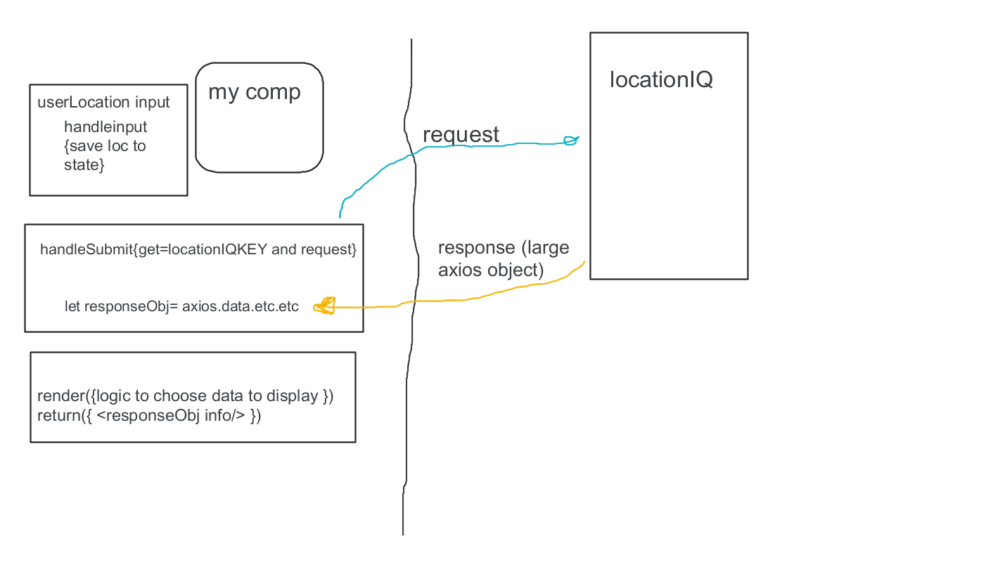
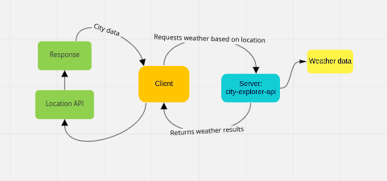
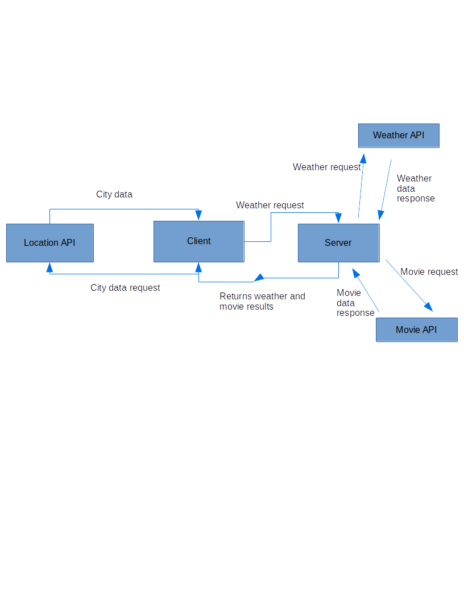

# City Explorer

**Author**: Dennis DeVries\
**Version**: 1.0.0

## Overview

City Explorer is a project built with React that will use a Axios library to make a request to an API. The request will get basic information on a requested city including location and end up displaying a map of it.

## Getting Started

In order to start the project on your own follow these steps:

1. Create Repository on GitHub called "City Explorer"
2. Create the react app in the desired folder using the command: `npx create-react-app city-explorer`

## Architecture

This application is built using React and uses a Axios library to request data from LocationIQ API.

## Change Log

06-20-2022 8:39pm EST - Initial app created and deployed on Netlify

## Credit and Collaborations

Kris Dunning - overview diagram

****************************************

## Time Estimates

### Feature 2

Time estimate:\
Start time:\
Finish time:\
Actual time:
